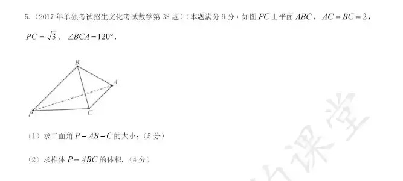
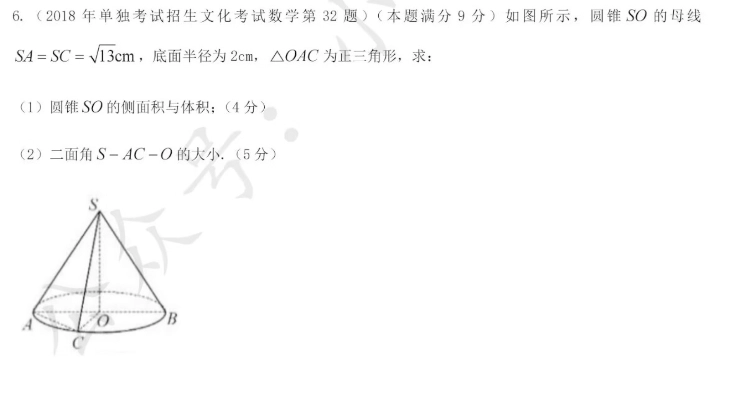
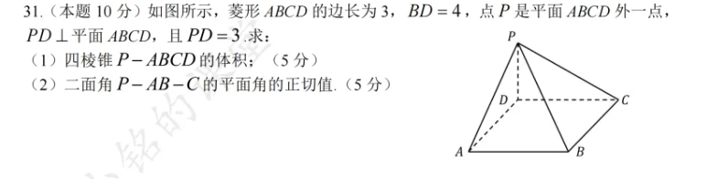

# 二面角
## 概念
- 通俗的看:两个面所成的夹角
- 专业的看:从一条直线出发的两个半平面所组成的图形叫做二面角。这条直线叫做二面角的棱，这两个半平面叫做二面角的面。
## 可能用到的知识点
- 一条线垂直于一个面两条不相交的直线，那么这个线垂直于这个面中的所有直线
- 二面角的取值范围为0度到180度

## 做题技巧
假设求二面角A-BC-D
1. 先在BC这条直线找一个点M，连接AM,DM(大概率！也可能是面ABC中的其他点)
2. 证明AM和DM⊥BC
3. 写结论∠AMD为二面角的平面角
4. 求∠AMD的值

## 题型1

## 题型2

## 题型3
